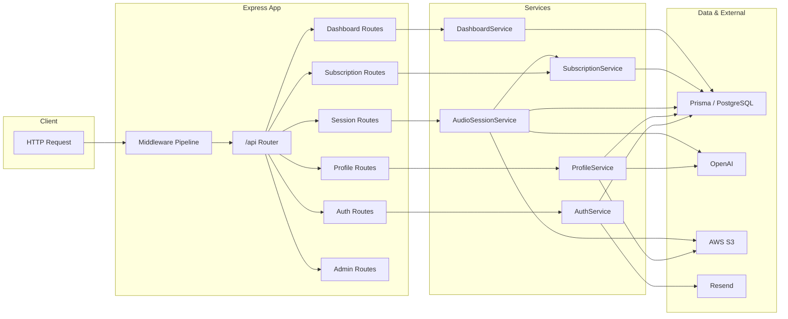

# Architecture (Brief)

## Purpose

Backend for an **AI-powered interview practice platform**. It handles user auth, profiles (including resume upload and extraction), audio sessions (record, transcribe, analyze), subscription tiers and usage limits, dashboard stats and insights, and optional admin tooling.

## Stack

- **Runtime:** Node.js (>= 18)
- **Framework:** Express
- **Language:** TypeScript
- **Database:** PostgreSQL with **Prisma** (ORM)
- **Auth:** JWT (access/refresh), optional Google OAuth
- **External:** OpenAI (GPT + Whisper), AWS S3, Resend (email), optional Redis for rate limiting

## High-Level Request Flow

1. **Entry:** [src/index.ts](src/index.ts) — loads env, runs startup validation, initializes the DI container, builds the Express app, applies middleware, mounts `/api` routes, then listens.
2. **Middleware pipeline (order):** Helmet, custom CSP, security headers, CORS, optional request logging and performance monitoring, request timeout (30s), validation/sanitization, optional API key check, rate limiting, abuse detection, body parsing (JSON/urlencoded), session security, health check, then `/api` router.
3. **Routes:** [src/routes/index.ts](src/routes/index.ts) mounts auth, profile, sessions, subscription, dashboard, and (if enabled) admin under `/api`. Each route module receives the **ServiceContainer** and calls the appropriate services.
4. **Services:** Implement business logic and call Prisma and external APIs (OpenAI, S3, Resend). Wired in [src/container.ts](src/container.ts).

## Layers

### Routes (HTTP)

- **Location:** [src/routes/](src/routes/)
- **Responsibility:** Parse HTTP (params, query, body), enforce auth and ownership, validate input (Joi via [src/middleware/validation.ts](src/middleware/validation.ts)), call services, format success/error responses.
- **Auth:** [src/middleware/auth.ts](src/middleware/auth.ts) — `authenticate`, optional auth, subscription tier, resource ownership, admin. Token refresh and account-status checks where used.
- **Security:** [src/middleware/security.ts](src/middleware/security.ts) — data isolation (profile, session, usage), CSP, admin-only, session security, optional API key.

### Services (Business logic)

- **Location:** [src/services/](src/services/)
- **Wiring:** [src/container.ts](src/container.ts) builds a single **ServiceContainer** used by all routes.
- **Main services:**
  - **AuthService** — register, login, JWT, Google OAuth, password reset (OTP + email via Resend).
  - **ProfileService** — profile CRUD, resume upload (S3), text extraction (PDF/DOC), skills extraction (OpenAI).
  - **AudioSessionService** — create session, upload audio (S3), transcription (Whisper), analysis (GPT), transcript update/re-analysis; enforces subscription usage via **SubscriptionService**.
  - **SubscriptionService** — tier and usage limits (UsageTracking).
  - **DashboardService** — stats, insights, trends from sessions and profile.
  - **OpenAIService** — GPT and Whisper calls with retries/timeouts.
  - **S3Service** — uploads and presigned URLs (resumes, audio).
  - **EmailService** — Resend (password reset).
  - **MonitoringService** — health and metrics.
  - **ErrorHandlingService** — circuit breakers, degradations, error classification.

### Data

- **ORM:** Prisma; schema in [prisma/schema.prisma](prisma/schema.prisma).
- **Models (summary):** User, UserProfile, AudioSession, UsageTracking, PasswordResetOTP, Industry (seed data). Migrations under `prisma/migrations/`.
- **Connection:** PrismaClient created in container, `$connect` at startup; singleton in dev to avoid multiple instances.

## External Integrations

| Service   | Use |
|----------|-----|
| **OpenAI** | Whisper (transcription), GPT (session analysis, profile/skills extraction). |
| **AWS S3** | Resume files, session audio; presigned URLs for download/playback. |
| **Resend** | Password reset emails (OTP). |
| **Google** | OAuth login (optional; GOOGLE_CLIENT_ID / GOOGLE_CLIENT_SECRET). |
| **Redis**  | Optional; rate limit store when `REDIS_URL` is set (otherwise in-memory). |

## Security

- **JWT:** Access (and optionally refresh) tokens; validated in `authenticate` middleware.
- **Rate limiting:** [src/middleware/rateLimiting.ts](src/middleware/rateLimiting.ts) — auth, password-reset, general API, upload, AI processing; optional Redis backend.
- **Admin:** Admin routes require `requireAdminAccess` (e.g. ADMIN_EMAILS / ADMIN_DOMAINS) and are only mounted when `ENABLE_ADMIN_ENDPOINTS` is true.
- **Data isolation:** Middleware ensures profile, session, and usage data are scoped to the authenticated user.
- **Input:** Joi validation and sanitization (XSS/injection mitigation) before business logic.

## Configuration

- **Source:** [src/utils/config.ts](src/utils/config.ts) — Joi-validated env; `dotenv` loads `.env`.
- **Startup:** [src/utils/startup.ts](src/utils/startup.ts) runs validation and optional health checks (DB, S3, OpenAI, etc.) before the server listens.
- Env covers: server (NODE_ENV, PORT), DATABASE_URL, JWT, OpenAI, AWS, CORS, admin/security, rate limits, file size/types, subscription limits, feature flags (rate limiting, abuse detection, admin endpoints, logging, monitoring), optional Redis/Sentry/Google/Resend.

## Key Files

| Layer / Concern | Path |
|-----------------|------|
| App entry       | [src/index.ts](src/index.ts) |
| API router      | [src/routes/index.ts](src/routes/index.ts) |
| DI / services   | [src/container.ts](src/container.ts) |
| Auth middleware| [src/middleware/auth.ts](src/middleware/auth.ts) |
| Validation      | [src/middleware/validation.ts](src/middleware/validation.ts) |
| Rate limiting   | [src/middleware/rateLimiting.ts](src/middleware/rateLimiting.ts) |
| Error handling  | [src/middleware/error.ts](src/middleware/error.ts) |
| Config          | [src/utils/config.ts](src/utils/config.ts) |
| Schema / DB     | [prisma/schema.prisma](prisma/schema.prisma) |
